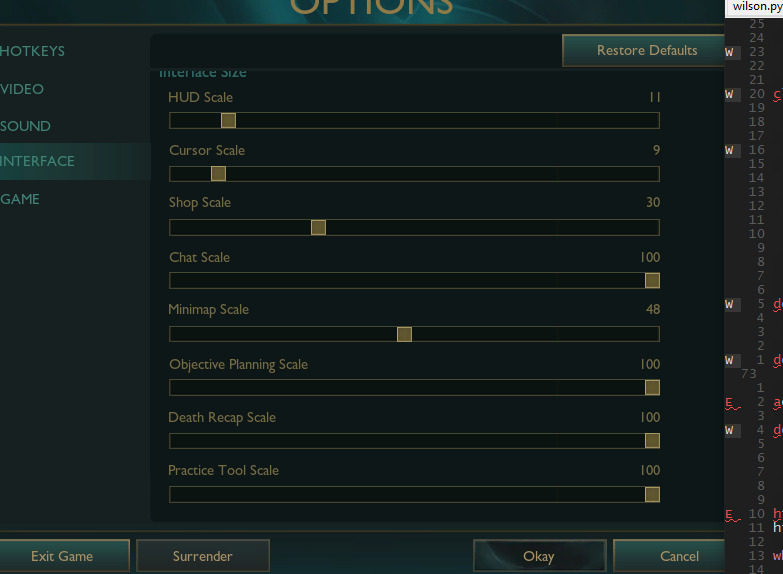
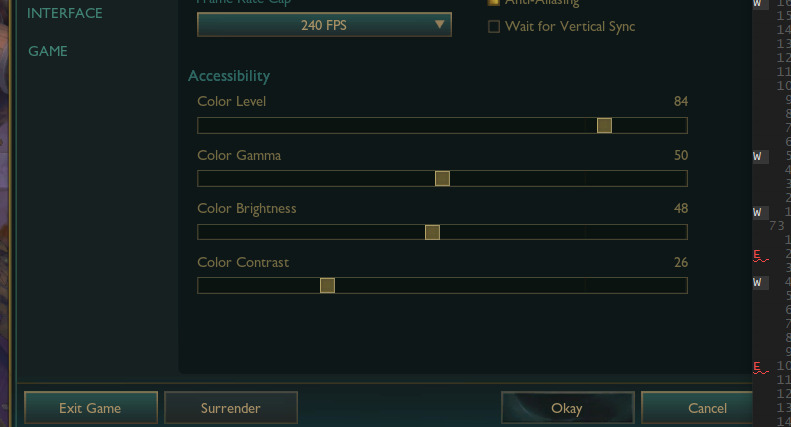

# Yellow Trigger

## Descripción

El "Yellow Trigger", funciona loopeando una revision de cierto pixel en la pantalla. Espera a que el color de ese píxel coincida con un valor RGB predeterminado para activarse.

## Configuracion del lol

Para asegurarse que funcione, el juego debe estar configurados con los siguientes parametros de video y de interfaz

1.  **Modo de Pantalla:** Ventana (Windowed)
2.  **Resolución:** 1920x1080
3.  **Parámetros de Video:** Deben coincidir exactamente con los que se muestran en la siguiente imagen:
    
4.  **Configuración del HUD:** El valor del HUD debe estar ajustado a **11**, como se indica en esta imagen:
    

**Importante:** Si la configuración del juego (modo de pantalla, resolución, ajustes de video o HUD) difiere de los parámetros indicados anteriormente, es muy probable que el script **no funcione** correctamente, ya que depende de la posición exacta de los elementos en pantalla y sus colores.
